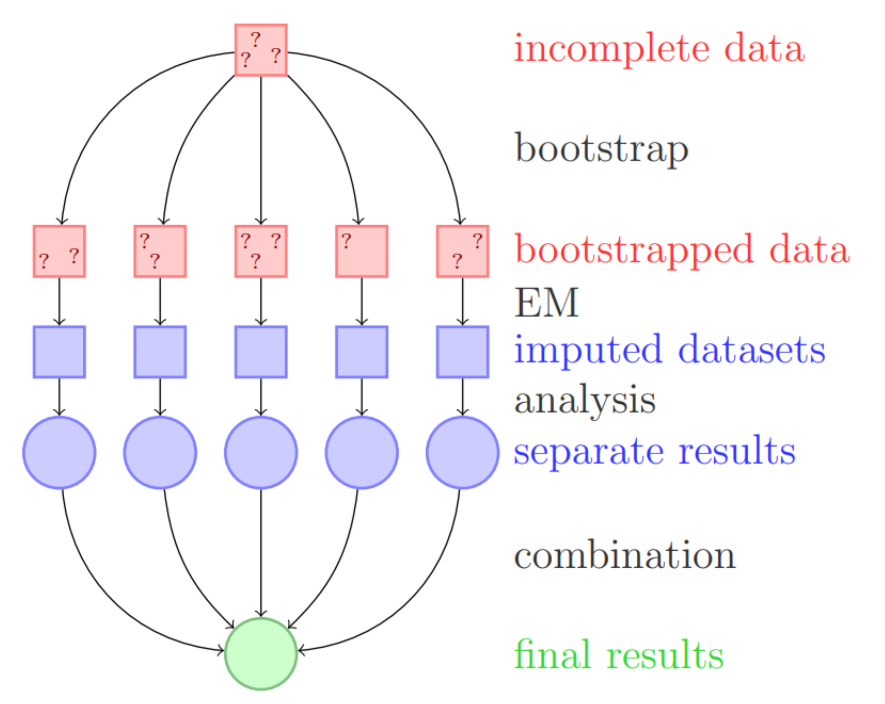
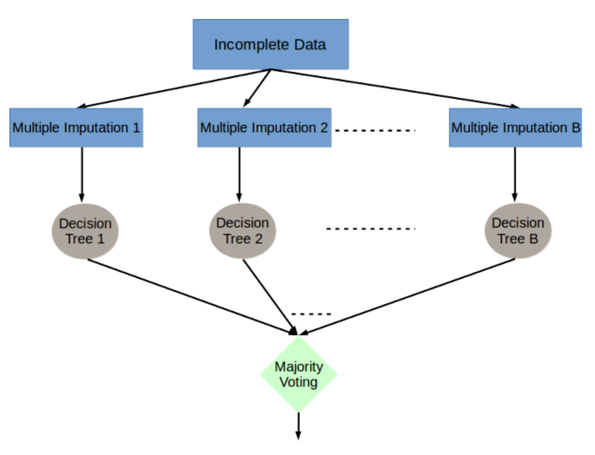
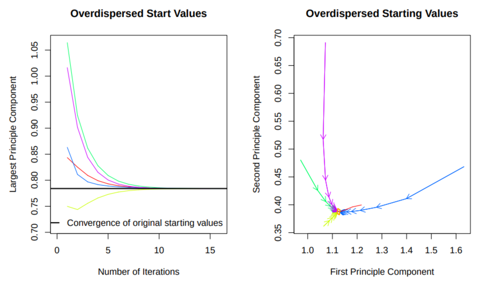

## Podstawowe działanie pakietu 
Z jednego datasetu zawierającego braki tworzmy kilka innych gdzie dane, które znajdowały się w pierwotnej ramce pozostają takie same. A brakujące wartości zostają uzupełnione zgodnie z rozkładem danych, różne datasety zapewniają oddanie niepewności.

## Amelia II’s EMB algorytm
Założenia:\
1.Dane (*D*) pochodzą z wielowymiarowego rozkładu normalnego:\
$D \sim N_{k}(\mu,\Sigma)$\
Dotyczy to istniejących obserwacji (*$D^{obs}$*) ale i brakujących (*$D^{obs}$*)\

2.Braki danych są typu *MAR* (missing at random) lub *MCAR* (missing completely at random) co można  sformalizować jako:\
Niech *M* bedzie macierzą gdzie $m_{ij}=1$ jeżeli $D_{ij} \in D^{obs}$ lub $m_{ij}=0$ w przeciwnym przypadku, wtedy:\
$p(M \mid D^{obs}) = p(M \mid D)$

## Podstway działania algroytmu EM
Interesuje nas parametr $\theta = (\mu,\Sigma)$ odpowiadjącemu rozkładowi *D*, naszymi danym są *$D^{obs}$* i *M*.\

Można więc zapisać gęstość $p(M,D^{obs} \mid \theta)$\ 
korzystając z założenia drugiego mamy:\
$p(M,D^{obs} \mid \theta)=p(M \mid D^{obs})p(D^{obs} \mid \theta)$.\

Omijając przekształcenia otrzymujemy:\
$L(\theta;D^{obs})=p(D^{obs} \mid \theta)=\int_{}^{}p(D^{obs},D^{mis} \mid \theta) dD^{mis}$\

Gdzie $L(\theta)$ - "likelihood". Zdefiniujmy jescze $l=log(L(\theta))$.

## Algorytm EM 
Zdefinujmy:\
$Q(\theta \mid \theta^{(t)})=E_{D^{mis}\mid D^{obs},\theta^{(t)}}[log(L(\theta;D^{obs},D^{mis})]$\
którę można przedstawić jako:\
$Q(\theta \mid \theta^{(t)})=\int_{}^{}l(\theta;D^{obs},D^{mis})p(D^{mis} \mid D^{obs}; \theta_t)dD^{mis}.$\

Działanie algorytmu:\
Zaczynamy od losowego wyznaczenia $\theta_0$ potem w t kroku:\ 

Maksymalizujemy $Q(\theta \mid \theta_t)$ i nadpisujemy parametr:\
$\theta_{t+1}=arg \displaystyle \max_{\theta} Q(\theta \mid \theta_t)$\

Powtarzamy aż do zbiegania. 

## Idea Bootstrap 
Polega na estymowaniu rozkładu zmiennych w następujący sposób.\

1.Wybieramy *n* elemetnową próbkę ze zwracaniem *M* razy.

2.Dystrybuante empiryczną liczymy jako: $F_n(y)=\frac{1}{n}\sum_{i=1}^{n}I(Y_i \le y)$\
(gdzie *I* - indykator)\

Po dokładną impelemntację bootstrapu do algortymu EM odsyłam do: https://www.nstac.go.jp/services/society_paper/27_06_01_Paper.pdf.

## Podstawowa funkcja pakietu Amelia 
amelia(x, m = 5, p2s = 1, frontend = FALSE,
idvars = NULL, ts = NULL, cs = NULL, polytime = NULL,
splinetime = NULL, intercs = FALSE, lags = NULL, leads = NULL,
startvals = 0, tolerance = 1e-04, logs = NULL, sqrts = NULL,
lgstc = NULL, noms = NULL, ords = NULL, incheck = TRUE,
collect = FALSE, arglist = NULL, empri = NULL, priors = NULL,
autopri = 0.05, emburn = c(0, 0), bounds = NULL,
max.resample = 100, overimp = NULL, boot.type = "ordinary",
parallel = c("no", "multicore", "snow"),
ncpus = getOption("amelia.ncpus", 1L), cl = NULL, ...).\ 

Postaram się omówi istotne parametry tej funkcij:\
**x-ramka danych lub macierz do imputacij (możliwe jest też użycie obiektów typu "amelia" lub "molist")**\

**m-ilość datesetów które chcemy otrzymać**\

**p2s-sposób wyświetlania(0-brak,1-podstawowe,2-szczegółowe)**

## Parametry CD.
idvars-nazwy lub numery niezdefiniowanych zmiennych\

ts- nazwy lub numery kolumn z szeregami czasowymi\

splinetime- im wyższa wartość parametru tym szybciej zbiega algorytm kosztem dokładności\

polytime - jak wyżej (mniejszy wpływ na dokładnoś ale pozwala ustawić tylko wartości 0-3)\

**startvals- macierz reprezntujaca które obserwacjie mają być usunietę (startvals=1 nie usuwa obserwacij)**\

tolerence- dopuszczalna toleracija zbierzności w algorytmie EM\

**logs - nazwy lub numery kolunm do transformacij logarytmicznej**\

## CD
**sqrt- nazwy lub numery kolumn do transformacij przez pierwiastek (kolumny muszą zawierać wartowści dodatnie)**\

**lgstc - nazwy lub numery kolumn które powinny zostać przekształcone przez regresję logistyczną (z 0-1 do danych proporcjonalnych)**\

noms - nazwy lub numery kolumn z danaymi kategorycznymi\ 
ords - jak wyżej ale zmienne z oczywistą kolejnością \
empir - wartośc decydująca o kowarjancij zmiennych powinna mieć wartość około 0.5-1
górny ograniczenime jest 10\

**priors - pozwala podać informacjie o brakujących zmiennych w następującym formacie:**\
**one.prior <-c(row,column,mean,standard deviation)**\
**lub**\
**one.prior <-c(row,column,minimum,maximum,confidence).**\

## CD
autopri - automatycznie tworzy powyższą macież (wartości 0-1) gdzie 0 oznacza wyłaczenie tej funkji\

**bounds - pozwala wyznaczyć grancę implementowanych warotści w następującej formie:**\
**c(column.number,lower.bound,upper.bound)**\

overimp -  pozwala zdecydować które wartości powinny być nadpisane pomimio tego ,że znajdują się w ramce w następującej fromie:\
c(row,column)

## Schemat imputacji algorytmem EMB

{width=600px, height=450px}

## Trenowanie modeli po imputacji

{width=600px, height=450px}

## Modelowanie i predykcja
***b*** - liczba imputacji

1. Przygotowanie zbioru treningowego i testowego
2. Wytrenowanie ***b*** modeli na ***b*** uzupełnionych zbiorach treningowych
3. Predykcja ***b*** wytrenowanymi modelami na ***b*** uzupełnionych zbiorach testowych 
4. Finalna predykcja
    + klasyfikacja: głosowanie większościowe
    + regresja: średnia z predykcji

## Pozostałe funkcje dostępne w pakiecie
**a.out** - output funkcji **amelia**()

1. Zapis output-u do plików csv
    + **write.amelia**(obj=a.out, file.stem="outdata")
2. Połączenie kilku output-ów
    + **ameliabind**(a.out1, a.out2, ...)
3. Wizualizacja braków
    + **missmap**(a.out)

## Analiza imputacji

1. Porównanie gęstości zmiennych po imputacji
    + **plot**(a.out, which.vars=1:5)
    + **compare.density**(a.out, var="")
2. Overimputing: przyjęcie kolejno wartości za brakujące, następnie porównanie imputowanych wartości do rzeczywistych
    + **overimpute**(a.out, var="")
3. Wizualizacja zbieżności algorytmu EM
    + **disperse**(a.out)

## Overimputing

{width=500px, height=500px}

## Zbieżność EM

{width=900px, height=500px}

## Transformacje i modele

1. Transformacje zmiennych
    + **transform**(a.out, new_col_name=log(col_name))
2. Pakiet Zelig umożliwia automatyczną implementację niektórych modeli na output-cie funkcji **amelia** np. regresję logistyczną
    + **zelig**(vote ~ age+race, model="logit", data=a.out)
3. Połączenie wyników z modeli za pomocą średniej
    + **mi.meld**()

## Przykłady

{width=500px, height=350px}

Zdecydowaliśmy się przedstawić działanie pakietu na przykładzie zbioru danych Titanic. Celem jest przewidzenie, która z osób przeżyła słynna katastrofę.

## Żródła 

[1]https://www.nstac.go.jp/services/society_paper/27_06_01_Paper.pdf \
[2]https://r.iq.harvard.edu/docs/amelia/amelia.pdf?fbclid=IwAR2HBnifAAs8EfX9WL6tPyD3mvQorI-lZWWlOG2YKyXSMLph9Tdvob-c_bc \
[3]https://cran.r-project.org/web/packages/Amelia/Amelia.pdf\
[4]https://arxiv.org/pdf/1802.00154.pdf
