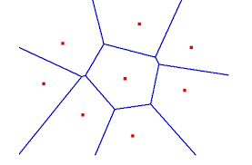

```{r setup, include=FALSE}
library(VIM)
library(dplyr)
library(visdat)
library(psych)
knitr::opts_chunk$set(echo = TRUE)
```

# Opis pakietu VIM

Zgodnie z rozwinięciem nazwy, pakiet VIM oferuje rozmaite techniki wizualizacji i imputacji brakujących danych w datasetach. W ramach wizualizacji wprowadza on wiele nowych, ciekawych narzędzi, często pomocnych w rozpoznaniu zawartości i cech danych, a samo wykrywanie brakóW danych wykonywane jest zazwyczaj poprzez statystyczne testy lub modele. Pakietu można używać na danych praktycznie dowolnego typu. Innymi atrakcjami dostępnymi w VIM są m.in. oryginalne zbiory danych przydatne do testowania funkcji, czy funkcje obrabiające lub badające dane, które jeszcze przejrzymy w raporcie.

# Zbiory danych w VIM

VIM udostępnia nam swoje zbiory z brakami danych. Można na nich przetestować znajdujące się w pakiecie funkcje do imputacji danych.

### Lista zbiorów VIM

W VIM dostępne jest 12 poniższych zbiorów danych:

- bcancer
- brittleness
- chorizonDL
- colic
- collisions
- diabetes
- food
- SBS5242
- sleep
- tao
- testdata
- toydataMiss

### Wstępna wizualizacja zbiorów

```{r}
data(bcancer, package = "VIM")
vis_dat(bcancer)
```

Bardzo mało NA. Zbiór do klasyfiacji. 

```{r}
data(brittleness, package = "VIM")
vis_dat(brittleness)
```

Bardzo mały zbiór. Zbiór do regresji.

```{r}
data(chorizonDL, package = "VIM")
vis_dat(chorizonDL)
```

Zbiór do do imputacji danych, regresji.

```{r}
data(colic, package = "VIM")
vis_dat(colic)
```

Wszystkiego po trochu. Dane medyczne o koniach.

```{r}
data(collisions, package = "VIM")
vis_dat(collisions)
```

W niektórych kolumnach są same NA, inne da się zaimputować. Zbiór zawiera daty.

```{r}
data(diabetes, package = "VIM")
vis_dat(diabetes)
```

Dobry zbiór danych do imputacji & klasyfikacji zmiennej celu Outcome.

```{r}
data(food, package = "VIM")
vis_dat(food)
```

Bardzo mały zbiór danych. Zmiennych tyle ile obserwacji. Kilka NA. W Country jest 16 unikalnych wartości. Zbiór co najwyżej do imputacji danych regresją.

```{r}
data(SBS5242, package = "VIM")
vis_dat(as.data.frame(SBS5242))
```

Zbiór dobry do regresji liniowej/ kNN w celu imputacji danych. kNN wymaga standaryzacji.

```{r}
data(sleep, package = "VIM")
vis_dat(sleep)
```

Mały zbiór. Pred, Exp, Danger przyjmują wartości 1,2,3,4,5 . 

```{r}
data(tao, package = "VIM")
vis_dat(tao)
```

Year, Longitude, Latitude - 2-3 levelowe factory. Dobre do klasyfikacji.

```{r}
data(testdata, package = "VIM")
vis_dat(testdata$wna)
```

To zbiór 'wna'. Dołączony jest też zbiór 'wona', który jest tym samym zbiorem, ale bez NA. Na tym zbiorze można testować skuteczność technik imputacji danych i porównywać z 'wona'.

```{r}
data(toydataMiss, package = "VIM")
vis_dat(toydataMiss)
```

Wszstkie oprócz numeric można traktować jako faktory. Niezbyt ciekawy do imputacji. yMiss są tymi samymi kolumnami, z brakami w innych miejscach.

Odnoszę wrażenie, że jeśli to zauważyłem to imputowałbym ten zbiór idealnie. Dzięki temu można dostrzec bezsensowne modele imputacji. Z punktu widzenia człowieka NA z jednej kolumny wynika z drugiej, ale czy komputer będzie na tyle inteligentny?

# Metody imputacji w VIM

W VIM dostępne są 4 metody imputacji danych:

- k-Nearest Neighbors  **kNN()**
- irmi  **irmi()**
- Hot-deck  **hotdeck()**
- Regression  **regressionImp()**

### k-Nearest Neighbors imputation

Imputacja k-Nearest Neighbour bazuje na _odległości Gowera_ charakterystycznej dla zmiennych numerycznych, kategorycznych, porządkowych, ciągłych oraz pół-ciągłych. W celu wyznaczenia tych odległości Gowera funkcja _kNN()_ wykorzystuje również wbudowaną w pakiet funkcję _gowerD()_ .

Parametry:

-  *k* będący liczbą najbliższych sąsiadów, domyślnie 5.
-  *dist_var* określa nazwy zmiennych służących do obliczenia odległości.
-  *weights* = wagi przypisywane zmiennym podczas liczenia odległości. W przypadku domyślnej "auto" będą to wagi wynikające z algorytmu lasu losowego "ranger". 
-  *numFun* = funkcja agregująca dla zm. ilościowych np. 'mean'
-  *catFun* = funkcja agregująca dla zm. jakościowych np. 'maxCat', 'sampleCat'

Tutaj _maxCat()_ i _sampleCat()_ pochodzą z pakietu VIM i służą odpowiednio do wyboru kategorii najczęstszej albo losowej z zadanymi prawdopdoobieństwami.

W celu dobrego działania algorytmu należy uprzednio przygotować dane. Numeryczne wartości powinny być ustandaryzowane. Służy do tego również wbudowana w pakiet funkcja _prepare_ .

Dzięki wyborze *dist_var* nie trzeba liczyć macierzy odległości dla całego zbioru danych, więc kNN jest dobre dla dużych zbiorów danych. Oczywiście hot-deck będzie szybszy, gdyż jest losową imputacją.

Warto wspomnieć, że dobrym zobrazowaniem decyzji jaką podejmuje algorytm 1-NN przy imputacji jest _diagram Woronoja_ : 



Przykładowe użycie algorytmu:

```{r}
#kNN
sleep_imp <- kNN(sleep)
head(sleep)
head(sleep_imp)
```

### irmi imputation

Skrót IRMI oznacza _iterative robust model-based imputation_. Metoda może zajmować się połączeniem zmiennych ciągłych, półciągłych, porządkowych i kategorycznych, wraz z outlierami.

IRMI buduje kolejkę modeli regresyjnych dla każdej zmiennej, które w razie potrzeby mogą też korzystać z pozostałych. Metoda na początku korzysta z prostej techniki imputacji, np. mediany. W każdej iteracji IRMI jedna zmienna jest używana jako zmienna odpowiedzi, a reszta służy jako regresory. Wyćwiczone na tej podstawie kolejne modele regresji liniowej służą potem wszystkie do reimputacji brakujących wartości. Proces jest powtarzany do osiągnięcia zbieżności lub określonej maksymalnej liczby iteracji (maxit). Według twórców tej imputacji, wykazał on w większości przypadków szybką zbieżność.

Przykład użycia:

```{r}

## irmi
form <- list(
  NonD = c('BodyWGT', 'BrainWGT'),
  Dream = c('BodyWGT', 'BrainWGT'),
  Sleep = c('BrainWGT')
) # kolumny od których ma zależeć imputacja

sleep_imp <- irmi(sleep, modelFormulas = form, trace = FALSE)

head(sleep)
head(sleep_imp)
```

### hot-deck imputation

Popularna i szeroko używana metoda, w której brakująca wartość jest uzupełniana z losowo wybranego, podobnego rekordu. W implementacji VIM przy hot-deckingu można określić zmienne do m.in. sortowania zbioru danych, budowania domen do imputacji lub sterowania wartościami NA. Ponadto na podstawie uzupełnianych kolumn można dodawać do bazy danych nowe z informacją, czy wartość kolumny w danym wierszu była imputowana (parametry _imp\_var_ i _imp\_suffix_; domyślnie kolumny są dodawane z przyrostkiem _imp_).

Przykład użycia:

```{r}
#hot-deck
sleep_imp <- hotdeck(sleep, variable=c("NonD", "Dream", "Sleep", "Span", "Gest"), ord_var = "BodyWgt", domain_var = "Pred")
head(sleep)
head(sleep_imp)
```

### regressionImp

Metoda imputuje brakujące wartości na podstawie modelu regresyjnego. Można w jej argumentach oprócz formuły określić rodzinę rozkładu jako parametr _family_ - np. _binomial_, _Gamma_, _quasipoisson_, _normal_ - lub odpornościowość regresji (parametr booleanowy _robust_). Metoda korzysta z funkcji _glm_ lub, jeśli wskazujemy rodzinę _normal_,  _lm_.

Imputacja przeprowadzana jest w miejscu. Podobnie jak _hotdeck_, funkcja _regressionImp_ oferuje nowe kolumny opisujące status imputacji, których obsługa działa identycznie.

Przykładowe użycie _regressionImp_ na zbiorze danych sleep:

```{r}
# regression
sleep_imp <- regressionImp(Dream+NonD+Span~BodyWgt+BrainWgt, data = sleep)

head(sleep)
head(sleep_imp)
```

Oraz na zbiorach danych chorizonDL i SBS5242:

```{r}
print(chorizonDL[1:20, c("B", "Cu", "Fe")])
chorImp <- regressionImp(B~Cu+Fe, data=chorizonDL)
print(chorImp[1:20, c("B", "Cu", "Fe", "B_imp")])
SBS <- as.data.frame(SBS5242)
print(SBS[50:70, c("PW", "Umsatz", "USB")])
SBSImp <- regressionImp(PW~Umsatz+USB, data=SBS)
print(SBSImp[50:70, c("PW", "Umsatz", "USB", "PW_imp")])
```


# Wizualizacja braków danych w VIM

VIM udostępnia nam również funkcje do wykresów, dzięki którym będziemy mogli inaczej zwizualizować braki danych.

### marginMatrix

```{r}
x <- sleep[, 1:5]
marginmatrix(x)
```

### ScatterJitt

```{r}
data(tao, package = 'VIM')
scattJitt(tao[, c("Air.Temp", "Humidity")])
```

### histMiss

```{r}
x <- tao[, c("Air.Temp", "Humidity")]
histMiss(x, only.miss = FALSE)
```

### scattMiss

```{r}
scattMiss(x)
```

### barMiss

```{r}
x <- sleep[, c("Exp", "Sleep")]
barMiss(x, only.miss = FALSE)
# mało intuicyjna, pierwszą kolumnę traktuje jako grupy, drugą do zliczania obserwacji
```

### spineMiss

```{r}
spineMiss(kNN(x), delimiter = "_imp")
```

# Dodatki

W VIM dostępne są również funkcje pomocnicze. Z niektórych tych funkcji korzystamy przy wstępnej obróbce, a niektóre liczą dla nas ciekawe statystyki dotyczące braków danych. Inne z kolei operują na kolorach.

### gapMiss()

FUnkcja oblicza różne statystyki dla długości sekwencji NA w wektorze.

```{r}
set.seed(54)
v <- rpois(100, lambda = 1) # z rozkładu Poissona
v[3:5] <- NA
v[6:9] <- NA
v[sample(100, 20)] <- NA

gapMiss(v, what = median) # mediana długości sekwencji NA
gapMiss(v, what = function(x) mean(x, trim = 0.05)) # średnia ucięta
gapMiss(v, what = function(x) psych::harmonic.mean(x))
```

### sampleCat()

Funkcja ta wyciąga level z faktora. Przyporządkując wagi odpowiednim obserwacjom, oblicza odpowiednie prawdopodobieństwa.

```{r}

v <- as.factor(c(1,1,2,2,3,3))

set.seed(800)
sampleCat(v, weights = c(0.1, 0.1, 0.5, 0.5, 2, 2))
sampleCat(v, weights = c(0.1, 0.1, 0.5, 0.5, 2, 2))
sampleCat(v, weights = c(0.1, 0.1, 0.5, 0.5, 2, 2))
sampleCat(v, weights = c(0.1, 0.1, 0.5, 0.5, 2, 2))
sampleCat(v, weights = c(10, 10, 0.5, 0.5, 2, 2)) # 1 z dużą wagą
sampleCat(v, weights = c(10, 10, 0.5, 0.5, 2, 2)) # 1 z dużą wagą

```

### prepare()

Funkcja do transformacji i standaryzacji danych. 

Transofmracja i standaryzacja są ważną obróbką wstępną w celu późniejszego zastosowania algorytmu k Nearest-Neighbors czy to do imputacji albo do uczenia nienadzorowanego w analizie skupień/klasteryzacji.

```{r}
data(sleep, package = "VIM")
x <- sleep[, c("BodyWgt", "BrainWgt")]

head(x,10)
head(prepare(x, scaling = "robust", transformation = "logarithm"),10)
```

### countInf(), countNA()

Funkcja zlicza Inf lub NA w wektorze. Nie działa dla ramek danych :( .

```{r}
dane <- c(5,Inf,-Inf, 5,-2, 5, Inf, 0, -Inf, 5, NA, NA, Inf, 6, 5, 9) 
countInf(dane) # 5
countNA(dane) # 2

```

### colSequence()

Oblicza kolory pośrednie między 2 kolorami. Model przestrzeni barw HCL lub RGB.

```{r}

p <- seq(0,1,length = 20)
cs <- colSequence(p, "cyan", "blue")
plot(x = 1:20, y = seq(2,20,length = 20), lty = 3, col = cs, cex = 2, lwd = 40, ylab = "Y", xlab = "X")
```

Widzimy kolory od turkusowego do niebieskiego.

### alphablend()
Funkcja zmienia przezroczystość naszego koloru w skali 0-1.
Zwraca kod heksadecymalny koloru

```{r}
alphablend("red", 0.1)
```

Przykład przezroczystości

```{r}
plot(x = 1:10, y = seq(2,20,2), lty = 3, col = alphablend("red", 0.1), cex = 2, lwd = 40, ylab = "Y", xlab = "X")
lines(x = 1:10, y = seq(2,20,2), lty = 1, col = alphablend("red", 0.1), type = "h", lw = 80)
lines(x = 1:10, y = seq(2,20,2), lty = 1, col = alphablend("red", 0.3), type = "h", lw = 30)
lines(x = 1:10, y = seq(2,20,2), lty = 1, col = alphablend("red", 0.5), type = "h", lw = 7)
lines(x = 1:10, y = seq(2,20,2), lty = 1, col = alphablend("red", 0.7), type = "h", lw = 3)
```

Kolory nakładając się na wykresie zmniejszają swoją przezroczystość.
