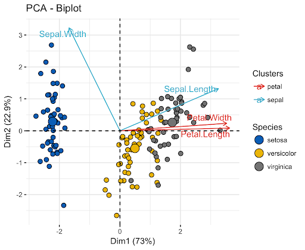

```{r packages, echo=FALSE, message=FALSE, warning=FALSE}
# Packages
library(OpenML)
library(naniar)
library(VIM)
library(missMDA)
library(FactoMineR)
library(ggplot2)
library(cowplot)

data(vnf)
options(Encoding="UTF-8")
```  

## Pakiet missMDA

* <font size="4">umożliwia obsługę brakujących wartości w <span style = "color:red;">metodach czynnikowych</span>  
(PCA, CA, MCA, MFA, FAMD),</font>  
* <font size="4">imputuje brakujące wartości w taki sposób, że <span style = "color:red;">przypisane wartości nie mają wag</span>.  
(tj. nie mają wpływu na wyniki; metody są wykonywane tylko z zaobserwowanymi wartościami),</font>  
* <font size="4"><span style = "color:red;"> oparty na metodach redukcji wymiarów </span>, pakiet missMDA z powodzeniem radzi sobie z dużymi, złożonymi zbiorami danych,</font>    
* <font size="4">może być stosowany do imputacji zmiennych zarówno numerycznych jak i kategorycznych.</font>  

## Objaśnienia  

* <font size="4"><span style = "color:red;">Analiza czynnikowa</span>  
Metoda statystyczna, której celem jest opisanie zależności między zaobserwowanymi, skorelowanymi zmiennymi przy pomocy możliwie mniejszej liczby zmiennych, które są wzajemnie nieskorelowane.</font>  
* <font size="4"><span style = "color:red;">Analiza głównych składowych</span>  
Zbiór danych składający się z N obserwacji, z których każda obejmuje K zmiennych, można interpretować jako chmurę N punktów w przestrzeni K-wymiarowej. Celem PCA jest taki obrót układu współrzędnych, aby maksymalizować w pierwszej kolejności wariancję pierwszej współrzędnej, następnie wariancję drugiej współrzędnej itd.. W ten sposób konstruowana jest nowa przestrzeń obserwacji, w której najwięcej zmienności wyjaśniają początkowe czynniki.</font>  


## Algorytm PCA    

|      | Mouse1 | Mouse2 | Mouse3 | Mouse4 | Mouse5 |
|------|------|------|------|------|------|
| Gene1 | 10    | 11    | 3    | 2    | 2    |
| Gene2 | 6    | 4    | 3    | 2.8    | 3    |
| Gene3 | 12    | 9    | 2.5    | 1.3    | 2    |
| Gene4 | 5    | 7    | 2    | 4    | 7    |    

## Algorytm PCA

<center>
   
</center>

## Algorytm PCA  

<center>
    
</center>

## Zbiór danych airquality

```{r missing_data_vis_1, dev.args=list(bg='transparent'), fig.align='center', echo=FALSE, results='hide'}
summary(aggr(airquality, sortVar=TRUE))$combinations
```  

##   

<font size="4"> **1.** Dla kroswalidacji leave-one-out (loo) każda komórka ramki danych jest alternatywnie usuwana i prognozowana za pomocą modelu PCA. Zwracana jest liczba wymiarów, która prowadzi do najmniejszego średniego błędu prognozowania (MSEP).</font>

```{r ncp1, dev.args=list(bg='transparent'), fig.height=3.3, fig.align='center', cache=TRUE}  
nb1 <- estim_ncpPCA(airquality, method='Regularized', 
                    verbose=FALSE, method.cv="loo", ncp.min=1)
plot(1:5, nb1$criterion, xlab="nb dim", ylab="MSEP")
title(paste("Result = ", nb1$ncp))
```  

##  

<font size="4"> **2.** Dla kroswalidacyjnej metody Kfold, imputowany jest odsetek pNA brakujących wartości a następnie prognozowany za pomocą modelu PCA przy użyciu od ncp.min do ncp.max wymiarów. Proces ten jest powtarzany nbsim razy. Jak wyżej zwracana jest liczba wymiarów, które prowadzą do najmniejszego MSEP.</font>  

```{r ncp2, dev.args=list(bg='transparent'), fig.height=3.3, fig.align='center', cache=TRUE}  
nb2 <- estim_ncpPCA(airquality, method='Regularized', pNA=0.05,
          method.cv="Kfold", ncp.min=1, nbsim=150, verbose=FALSE)
plot(1:5, nb2$criterion, xlab="nb dim", ylab="MSEP")
title(paste("Result = ", nb2$ncp))
```   

##  

<font size="4"> **3.** Kryterium kroswalidacji GCV może być postrzegane jako przybliżenie kryterium loo, które zapewnia prosty sposób oszacowania liczby wymiarów bez uciekania się do metod intensywnych obliczeniowo. </font>   
```{r ncp3, dev.args=list(bg='transparent'), fig.height=3.5, fig.align='center', cache=TRUE}  
nb3 <- estim_ncpPCA(airquality, method='Regularized', ncp.min=1,
                    method.cv="gcv", verbose=FALSE)
plot(1:5, nb3$criterion, xlab="nb dim", ylab="MSEP")
title(paste("Result = ", nb3$ncp))
```   

## Imputacja

## Metoda ustandaryzowana

<font size = "4"> Standaryzowany iteracyjny algorytm PCA w pierwszym kroku polega na imputowaniu brakujących wartości wartościami początkowymi, takimi jak średnia zmiennej. Jeśli parametr seed ustawiony jest na określoną wartość, przeprowadzana jest losowa inicjalizacja: wartości początkowe są przypisane z rozkładu gaussowskiego ze średnią i odchyleniem standardowym obliczonym na podstawie zaobserwowanych wartości.  
Uwaga: można zdefiniować inną losową inicjalizację. W takiej sytuacji zachowane jest rozwiązanie dające najmniejszy błąd średniokwadratowy.    

Drugim krokiem (standaryzowanego) iteracyjnego algorytmu PCA jest wykonanie PCA na skompletowanym zbiorze danych. Następnie przypisuje brakujące wartości za pomocą (uregulowanych) wzorów rekonstrukcyjnych rzędu ncp. Te etapy oszacowania parametrów za pomocą PCA i przypisania brakujących wartości z rozkładu rozmalnego są powtarzane iteracyjnie aż do uzyskania zbieżności.   
Zalecane jest korzystanie ze znormalizowanej wersji algorytmu, aby uniknąć problemów z nadmiernym dopasowaniem, które są bardzo częste, gdy w danych  brakuje wielu wartości. </font>   

## Metoda ustandaryzowana

```{r imputation1}
res.comp <- imputePCA(airquality, ncp=nb3$ncp, 
                      method="Regularized") 

# Dane po imputacji
head(res.comp$completeObs)
```  

## Metoda EM  

<font size = "4"> Metoda maksymalizacji wartości oczekiwanej to metoda estymacji parametrów modelu probabilistycznego ze zmiennymi ukrytymi polegająca na iteracyjnej maksymalizacji funkcji wiarygodności. Każda iteracja algorytmu EM składa się z dwóch kroków:  
1. <span style = "color:red;"> **kroku E** </span>, dla aktualnego układu parametrów rozkładu wyestymuj wartości, które zmaksymalizują wartość funkcji wiarygodności,  
2. <span style = "color:red;"> **kroku M** </span>, zmiana aktualnych parametrów rozkładu na takie, które prowadzą do modelu bardziej zgodnego z danymi.  
Kroki wykonywane są tak długo, aż pomiędzy kolejnymi przebiegami nie dochodzi do zauważalnej poprawy. </font>   

## Metoda EM  

```{r imputation2}
res.comp <- imputePCA(airquality, ncp=nb3$ncp, method="EM") 

# Dane po imputacji
head(res.comp$completeObs)
```  

## Wynik algorytmu PCA 

```{r imputed_data_vis2, dev.args=list(bg='transparent'), fig.height=4, fig.align='center'}
res.pca <- PCA(res.comp$completeObs, graph=FALSE)
plot.PCA(res.pca, choix="var", graph.type='ggplot') +
  theme(plot.background=element_rect(fill=NA, color=NA))
```      

## Interpretacja wykresu  

<font size="4">Rozważane wymiary są kombinacjami liniowymi zmiennych.   
Punkty zaczepienia poszczególnych wektorów stanowią współczynniki w kombinacjach liniowych dla danej zmiennej odpowiednio w 1. i 2. nowo utworzonym wymiarze.  
Wykres pokazuje relacje między wszystkimi zmiennymi.  
Można go interpretować następująco:</font>   
* <font size="4">Dodatnio skorelowane zmienne są grupowane razem.</font>   
* <font size="4">Zmienne ujemnie skorelowane są umieszczone po przeciwnych stronach początku wykresu (przeciwne ćwiartki).</font>   
* <font size="4">Długość wektora mierzy jakość zmiennych. Im dłuższy wektor, tym zmienna bardziej reprezentatywna.</font>  

<font size="4">Z sześciu wymiarów (wektory) mamy dwa (osie). Współrzędne każdego punktu w nowej przestrzeni można wyliczyć z kombinacji liniowej. Szukamy takiej kombinacji liniowej by zmaksymalizować wariancję w nowej przestrzeni. Procenty widoczne na osiach, to procenty wariancji danych, jakie są uwzględnione w danym wymiarze. </font> 


## Wizualizacja niepewności
```{r uncert1, dev.args=list(bg='transparent'), fig.align="center", fig.show="hold"}
res.mipca <- MIPCA(airquality, scale = TRUE, ncp = 2)
plot.MIPCA(res.mipca, 'var')
``` 

## Wizualizacja niepewności

```{r uncert2, dev.args=list(bg='transparent'), fig.align="center", fig.show="hold"}
plot.MIPCA(res.mipca, choice='dim')
``` 

## Zbiór danych vnf

```{r missing_data_vis_4, dev.args=list(bg='transparent'), fig.align='center', echo=FALSE, results='hide'}
summary(aggr(vnf, sortVar=TRUE))$combinations
```  

## Metoda MCA

<font size = "4">Metoda MCA stanowi odpowiednik metody PCA dla zmiennych <span style = "color:red;">kategorycznych</span>. Polega ona na zakodowaniu danych z brakami w postaci <span style = "color:red;">complete disjunctive table</span>. Brakujące dane inicjalizowane są proporcjami kategorii, dla każdej kategorii, przy użyciu niebrakujacych wartości (proces ten bywa określany jako "missing fuzzy average method"). Następnie stosowana jest omówiona już metoda PCA. Wynikowa ramka, w miejsach pierwotnych braków, zawiera wartości z przedziału [0, 1], które mogą być interpretowane jako prawdopodobieństwa przynależności do danej kategorii.</font>  

## Przypadek zmiennych ciągłych (PCA)

|      | C1 | C2 |
|------|----|----|
| Obs1 | 1 | 10  |
| Obs2 | 2  | 12  |
| Obs3 | 7  | 1  |
| Obs4 | 8  | 3  |
| Obs5 | ? 4.5 ?  | 13 |

## Przypadek zmiennych kategorycznych (MCA)

Data table:
 
|      | Q1 | Q2 |
|------|----|----|
| Obs1 | A  | C  |
| Obs2 | A  | D  |
| Obs3 | B  | E  |
| Obs4 | A  | D  |
| Obs5 | ?  | D  |

## Przypadek zmiennych kategorycznych (MCA)

Complete disjunctive table:

|      | Q1-A | Q1-B | Q2-C | Q2-D | Q2-E |
|------|------|------|------|------|------|
| Obs1 | 1    | 0    | 1    | 0    | 0    |
| Obs2 | 1    | 1    | 0    | 1    | 0    |
| Obs3 | 0    | 1    | 0    | 0    | 1    |
| Obs4 | 1    | 0    | 0    | 1    | 0    |
| Obs5 | ? 0.75 ? | ? 0.25 ? | 0    | 1    | 0    |

## Imputacja

```{r ncp4, dev.args=list(bg='transparent'), fig.height=3.3, fig.align='center', cache=TRUE}  
nb4 <- estim_ncpMCA(vnf, method='Regularized', 
                    verbose=FALSE, method.cv="Kfold")
plot(1:5, nb1$criterion, xlab="nb dim", ylab="MSEP")
title(paste("Result = ", nb4$ncp))
```  

## Imputacja

```{r imputation3}
res.comp <- imputeMCA(vnf, ncp=nb4$ncp, 
                      method="Regularized") 

# Dane po imputacji
res.comp$tab.disj[25:30, 1:6]
```

## Imputacja

```{r imputation4}
res.comp$completeObs[25:30, 1:2]
```

## Wynik algorytmu MCA

```{r imputed_data_vis3, dev.args=list(bg='transparent'), fig.height=4, fig.align='center'}
res.pca <- MCA(res.comp$completeObs, graph=FALSE)
plot.MCA(res.pca, choix="var", graph.type='ggplot') +
  theme(plot.background=element_rect(fill=NA, color=NA))
```     

## Wizualizacja niepewności

```{r uncert3, dev.args=list(bg='transparent'), fig.align="center", fig.show="hold", cache=T}
res.mimca <- MIMCA(vnf, ncp=nb4$ncp)
plot.MIMCA(res.mimca, choice='dim')
``` 


## Dane wine
```{r wine_dataset, echo=FALSE}
data("wine")
wine <- wine[,c(1,2,16,22,28,29,30,31)]

x <- sample(nrow(wine), 3)
y <- sample(nrow(wine), 3)
wine$Label[x] <- NA
wine$Harmony[y] <- NA

```


```{r summary_wine, dev.args=list(bg='transparent'), fig.align='center'}
summary(aggr(wine, sortVar = TRUE))$combinations
```

## Metoda FAMD

<font size = "4">
Z grubsza można powiedzieć, że FAMD (factor analysis of mixed data) działa jak PCA dla zmiennych ciągłych i MCA dla zmiennych kategorycznych.

Kiedy dane zawierają oba typy danych, ale obecnie aktywne zmienne są homogenicznych typów, PCA lub MCA może zostać użyte.

Kiedy aktywne dane są typów mieszanych, stosuje się dyskretyzację zmiennych ciągłych (np. wiek może zostać zamieniony na grupy wiekowe), a następnie może zostać użyte MCA.

</font>

## Estymacja ncp dla FAMD

```{r ncp5, dev.args=list(bg='transparent'), fig.align='center', cache=TRUE, eval=TRUE, results="hide"}  

nb5 <- estim_ncpFAMD(wine, ncp.max = 4, ncp.min=1)
```  
```{r plotncp5, fig.width=7}
plot(1:4, nb5$criterion, xlab="nb dim", ylab="MSEP")
title(paste("Result = ", nb5$ncp))

```

## Imputacja

```{r imputation5}
res.comp <- imputeFAMD(wine, nb5$ncp, 
                      method="Regularized") 
# Dane po imputacji
res.comp$tab.disj[1:10,c(1:6,10)]
```

## Imputacja
```{r imputation6}
res.comp$completeObs[1:7, ]
```


## Wynik algorytmu FAMD 
```{r imputed_data_vis4, dev.args=list(bg='transparent'), fig.height=4, fig.align='center'}
res.famd <- FAMD(res.comp$completeObs, graph=FALSE)
plot.FAMD(res.famd, choix="var", graph.type='ggplot') +
  theme(plot.background=element_rect(fill=NA, color=NA))
```     

## Mapa danych kategorycznych
```{r uncert4, fig.height=4, dev.args=list(bg='transparent'), fig.align="center", fig.show="hold", cache=T}
plot(res.famd, choix = "ind") +
  theme(plot.background=element_rect(fill=NA, color=NA))
``` 

## Graf dla danych numerycznych

```{r, dev.args=list(bg='transparent'), fig.align="center"}
plot(res.famd, choix = "quanti") +
  theme(plot.background=element_rect(fill=NA, color=NA))
```

## Metoda MFA

MFA (multiple factor analysis) - to metoda rozszerzająca opisaną wcześniej metodę FAMD. Funkcja imputeMFA, jak sama nazwa wskazuje, wykorzystuje algorytm MFA do imputacji braków danych. Przyjmuje on dodatkowe argumenty: groups i type, za ich pomocą dzieli zmienne na podane przez nas grupy. Zmienne w grupach są tak przeskalowywane aby każda grupa równomienia wpływała na wynik. W każdej grupie każda zmienna ma taką samą wagę. W ramce mogą być zarówno dane numeryczne jak i kategoryczne, jednak wewnątrz jednej grupy muszą one mieć ten sam typ. 

## IMPUTACJA

```{r, cache=T}
res.comp <- imputeMFA(wine, group = c(2,2,4), type=c("n","s","s"))
# Dane po imputacji
res.comp$tab.disj[1:10,c(1:7,10)]
```

## Imputacja
```{r imputation7, eval=TRUE}
res.comp$completeObs[1:7, ]
```

## GRAFY DLA MFA

```{r, dev.args=list(bg='transparent'), fig.height=4, fig.align="center"}
res.mfa <- MFA(wine, 
               group = c(2,2,4),
               type = c("n", "s", "s"),
               graph = TRUE, ncp=2)

```


## Przystępne wytłumaczenie metody

https://www.youtube.com/watch?v=FgakZw6K1QQ

Inne linki:

https://en.wikipedia.org/wiki/Principal_component_analysis

https://en.wikipedia.org/wiki/Multiple_correspondence_analysis

https://en.wikipedia.org/wiki/Factor_analysis_of_mixed_data

https://en.wikipedia.org/wiki/Multiple_factor_analysis